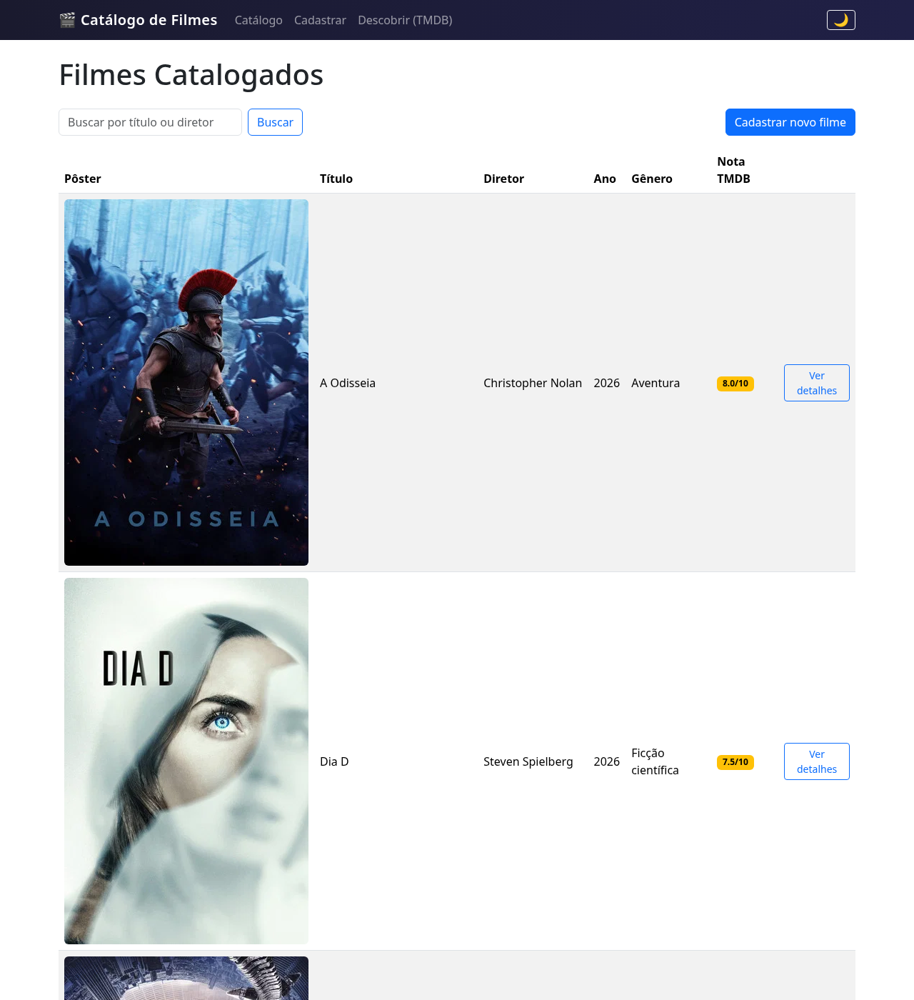
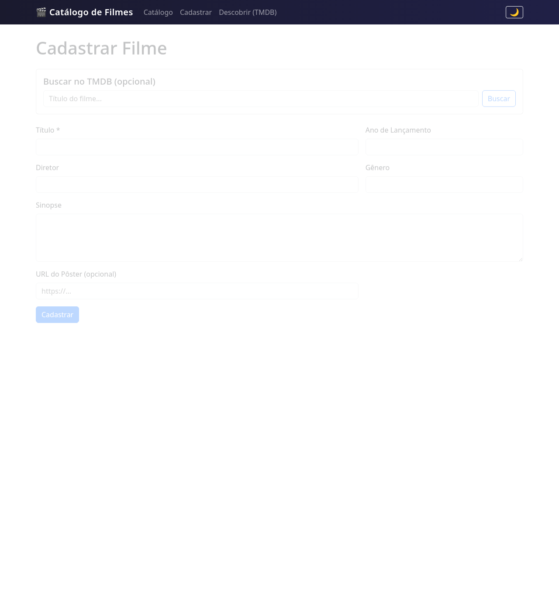
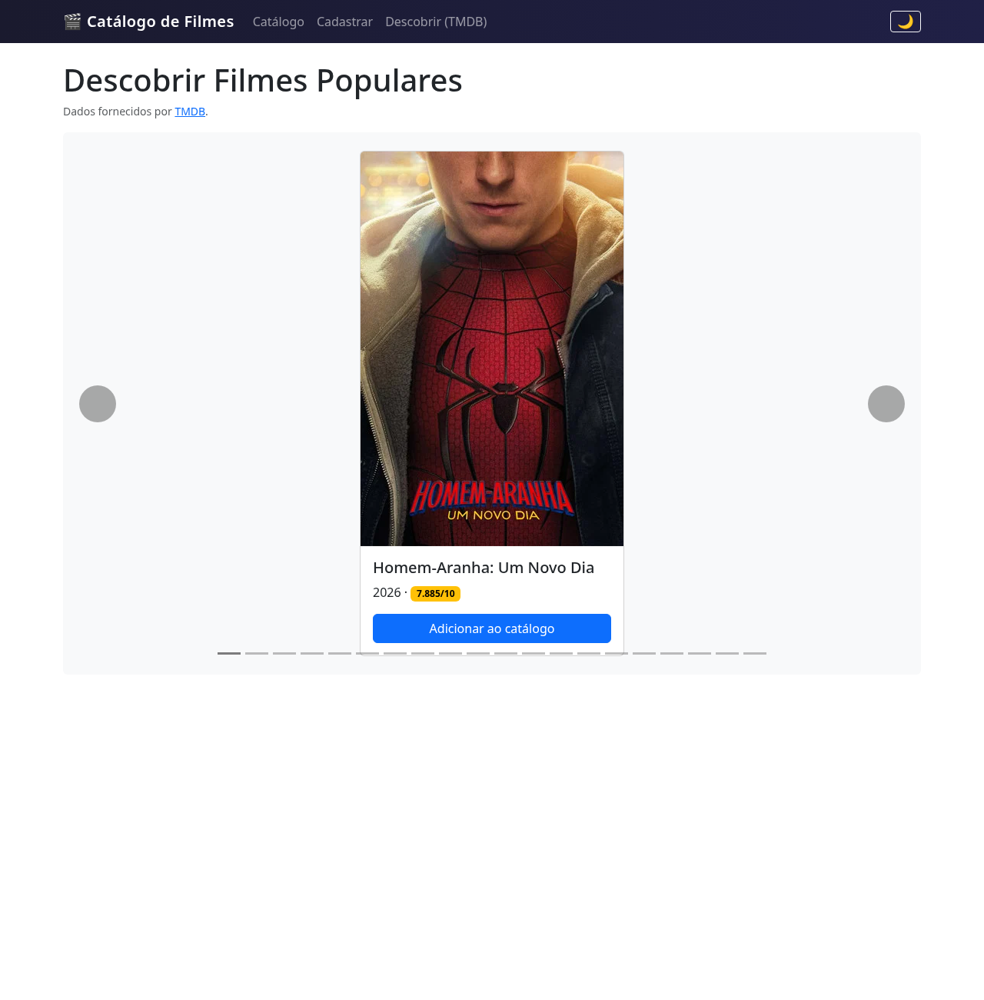
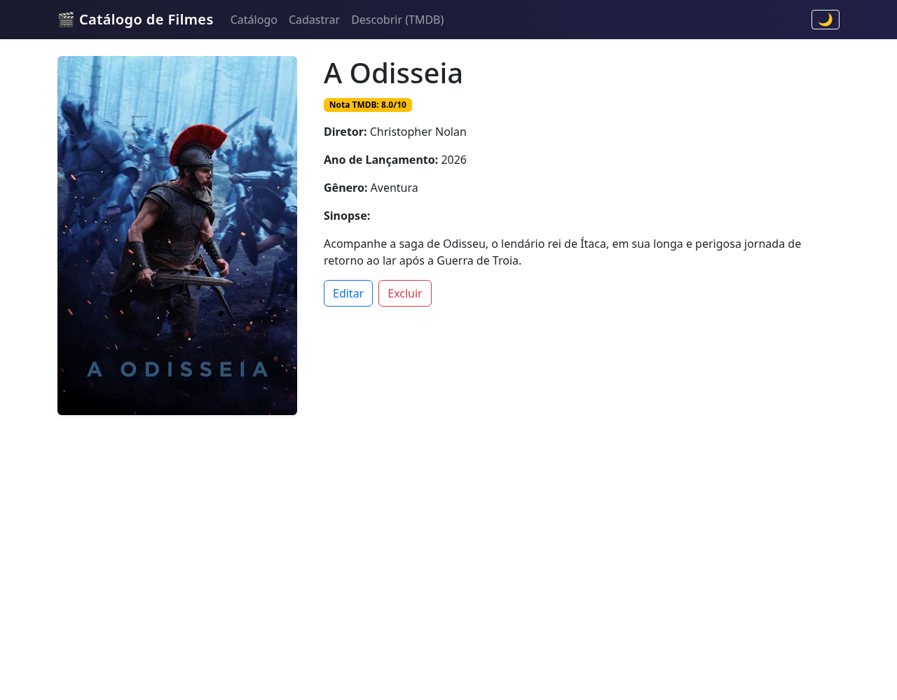
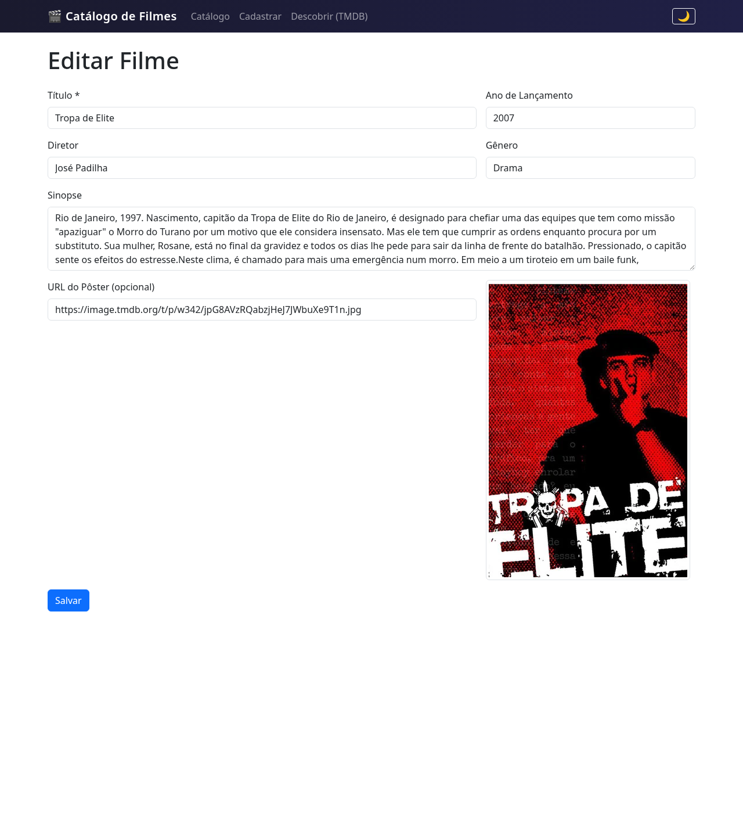

# Manual do Usuário — Catálogo Simples de Filmes

Este é um guia rápido de uso da aplicação web **Catálogo Simples de Filmes**, desenvolvida como
Projeto Integrador Transdisciplinar (PIT em Ciência da Computação, Cruzeiro do Sul Virtual).
Não é um documento técnico — para detalhes de arquitetura, modelagem e segurança, veja
`docs/relatorio-tecnico/relatorio-tecnico.tex`. Para documentação do código, veja o Javadoc das
classes em `com.catalogo`.

## 1. Como acessar a aplicação

A aplicação é um WAR Java (Servlets + JSP) que roda em um servidor Tomcat, com um banco de
dados MySQL/MariaDB. Após o `deploy` local (ex.: via Maven + Tomcat), acesse no navegador:

```
http://localhost:8080/catalogo-simples-filme/listarFilmes
```

Essa é a tela inicial: a listagem de todos os filmes já cadastrados no catálogo.



Não é necessário login — o catálogo é de uso pessoal e todas as funcionalidades estão
disponíveis a qualquer visitante do endereço acima.

## 2. Como cadastrar um novo filme

1. Na tela de listagem, clique em **"Cadastrar Filme"** (ou acesse diretamente
   `/cadastrarFilme`).
2. Preencha o formulário: **Título** (obrigatório), Diretor, Ano de Lançamento, Gênero, Sinopse
   e, opcionalmente, a URL de uma imagem de capa (pôster).
3. Se preferir, use o campo de **busca no TMDB** (The Movie Database) dentro do próprio
   formulário: digite o título do filme, escolha um dos resultados e os campos (incluindo o
   pôster) são preenchidos automaticamente — revise antes de salvar.
4. Clique em **"Salvar"**. Se algum dado estiver inválido (ex.: título vazio, ano não numérico,
   ou um filme com o mesmo título/ano já cadastrado), uma mensagem clara explica o problema, sem
   perder o que você já digitou.
5. Após salvar com sucesso, você é redirecionado à listagem, com uma mensagem de confirmação.



### 2.1. Descobrir filmes populares (TMDB)

No menu, acesse **"Descobrir"** (`/descobrirFilmes`) para navegar por um carrossel de filmes
populares, com pôster e nota do TMDB. Clique em **"Adicionar ao catálogo"** em qualquer filme
para importá-lo diretamente, sem precisar preencher o formulário manualmente.



Se a integração com o TMDB estiver indisponível (sem conexão ou sem configuração), essas duas
funcionalidades (carrossel e busca dentro do cadastro) ficam temporariamente fora do ar, mas o
cadastro manual e todo o restante do catálogo continuam funcionando normalmente.

## 3. Como listar e buscar filmes

A tela inicial (`/listarFilmes`) já exibe todos os filmes cadastrados, com título, diretor, ano
e gênero. Para buscar um filme específico, use o campo de busca no topo da listagem: digite
parte do **título** ou do **diretor** e clique em "Buscar" — a lista é filtrada para mostrar
apenas os filmes correspondentes. Deixe o campo vazio e busque novamente para voltar a ver todos
os filmes.

## 4. Como visualizar detalhes de um filme

Clique em qualquer filme da listagem (ou no link/botão "Ver detalhes") para abrir sua página de
detalhe, com todas as informações cadastradas: título, diretor, ano, gênero, sinopse, pôster e
nota do TMDB (quando disponível).



A partir dessa tela você também acessa as opções de **editar** e **excluir** o filme.

## 5. Como editar um filme

1. Na página de detalhe do filme, clique em **"Editar"**.
2. O formulário abre pré-preenchido com os dados atuais.
3. Altere os campos desejados e clique em **"Salvar"**. As mesmas validações do cadastro se
   aplicam (título obrigatório, ano numérico, etc.).
4. Após salvar, você volta à página de detalhe com os dados atualizados e uma mensagem de
   confirmação.



## 6. Como excluir um filme

1. Na página de detalhe do filme, clique em **"Excluir"**.
2. Uma caixa de confirmação pergunta se você tem certeza — essa é uma ação **irreversível**.
3. Ao confirmar, o filme é removido do catálogo e você é redirecionado à listagem, com uma
   mensagem de confirmação.

## 7. Dúvidas frequentes

- **Preciso de conta/login?** Não. O catálogo é de uso pessoal, sem autenticação — qualquer
  pessoa com acesso ao endereço da aplicação pode cadastrar, editar e excluir filmes. Isso é uma
  decisão consciente de escopo do projeto acadêmico (ver seção "Considerações sobre Segurança"
  do Relatório Técnico).
- **O que acontece se eu tentar cadastrar um filme sem título?** O sistema recusa o cadastro e
  mostra a mensagem "O campo Título é obrigatório.", sem perder os outros campos preenchidos.
- **O carrossel "Descobrir" não carrega — é um bug?** Provavelmente a integração com o TMDB está
  temporariamente indisponível; o restante do catálogo (cadastro manual, listagem, busca,
  edição, exclusão) continua funcionando normalmente.
