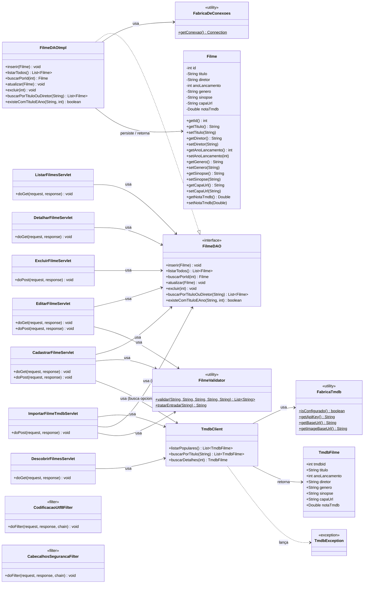

# Diagrama de Classes — Catálogo Simples de Filmes (Mermaid)

Versão em [Mermaid](https://mermaid.js.org/) do diagrama de classes consolidado do projeto,
equivalente a [`diagrama-classes-geral.puml`](diagrama-classes-geral.puml) (PlantUML), mas
gerada diretamente a partir do estado atual do código-fonte (`src/main/java/com/catalogo/`) —
inclui, portanto, itens adicionados em iterações posteriores à primeira versão do `.puml`:
`FilmeDAO.existeComTituloEAno`, `FabricaDeConexoes`, `CabecalhosSegurancaFilter` e
`TmdbException`.

O GitHub renderiza o bloco ```` ```mermaid ```` abaixo automaticamente ao visualizar este
arquivo no repositório.



## Observações

- **Filtros** (`CodificacaoUtf8Filter`, `CabecalhosSegurancaFilter`) são `@WebFilter("/*")` —
  aplicam-se a toda requisição/resposta, sem relação direta de uso com as demais classes
  (por isso aparecem no diagrama sem setas de dependência).
- `FabricaDeConexoes` e `FabricaTmdb` são classes utilitárias (construtor privado, só métodos
  estáticos) — estereotipadas como `<<utility>>`.
- `FilmeDAOImpl.existeComTituloEAno` e a checagem de duplicidade em `CadastrarFilmeServlet`/
  `ImportarFilmeTmdbServlet` foram adicionadas depois da primeira versão do diagrama PlantUML
  (correção de bug de cadastro duplicado) — este arquivo Mermaid já reflete isso; o `.puml`
  ainda não foi atualizado.
